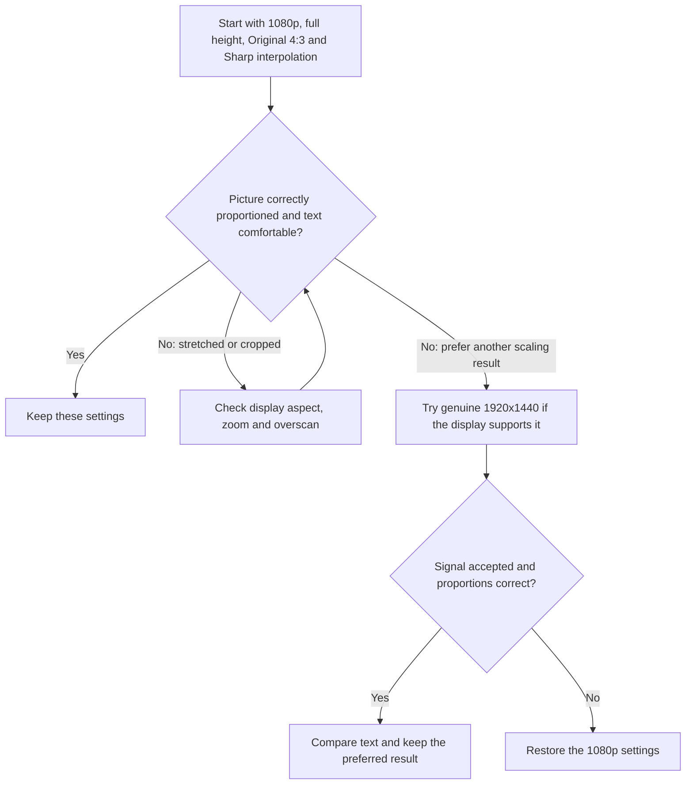

# HDMI setup

Start with **1080p, Original 4:3, full-height scaling and Sharp interpolation**.
This keeps the interface's proportions, fills the screen vertically and smooths
uneven text strokes. Side bars are normal on a widescreen display.

## Recommended starting point

1. For a direct HDMI connection to a modern display, select **Options > Video
   output > 480p (HDMI)** in Plex. This is the core's source signal; MiSTer's
   scaler produces the final HDMI resolution. Keep CRT safety restrictions in
   place if an analog CRT is also connected.
2. In the MiSTer OSD, leave **HDMI scaling** on **Normal**. HDMI aspect is fixed at
   **4:3**. Leave **Force 480i** **Off** for this HDMI setup.
   Older cores have an **HDMI aspect** choice instead; select **Original 4:3**.
3. Add or update this section in the **active MiSTer INI**, preserving other
   settings. If you use an alternate configuration, edit that file rather than
   assuming `MiSTer.ini` is active. Keep the section below the `[MiSTer]`
   settings: MiSTer reads the file from top to bottom, and later values win.
   Reload the core after saving.

   ```ini
   [MisterZine Plex Core]
   video_mode=8
   direct_video=0
   vscale_mode=0
   vscale_border=0
   vrr_mode=0
   ```

   This selects 1920x1080 at 60 Hz, scaled HDMI output and full-height scaling
   without an added border, and turns variable refresh rate off (see
   [below](#variable-refresh-rate-vrr-freesync)). These settings are scoped to
   Plex; other cores keep your global settings.
4. In **Video Processing**, set the horizontal filter to **From file** and choose
   **Interpolation (Sharp).txt**. Set the vertical filter to **From file** and
   choose the same file. Select an actual file; an empty selection is not this
   preset. No CRT simulation or scanline effect is needed.
5. On the display, preserve the incoming aspect ratio and disable zoom/overscan
   if the edges are cropped. The interface should reach the top and bottom,
   with side bars on a 16:9 screen.

## Choosing an alternative



- **Compatible higher-resolution displays:** `video_mode=12` selects genuine
  1920x1440 at approximately 60 Hz. It looked clear and correctly proportioned
  on the tested 4K monitor, including with NearNeighbour filtering. Keep
  full-height scaling and Original 4:3. Other displays may reject this timing
  or stretch it; have a way to restore the INI. This is not MiSTer's
  pixel-repeated 2560x1440 mode.
- **720p or 480p displays:** use a supported output mode (`video_mode=0` for
  1280x720, `6` for 640x480, or `2` for 720x480). Check proportions and text on
  the actual display. Lower-resolution trials remained usable, but were not
  preferred over the higher-resolution options. Filtering can trade sharpness
  for more even strokes; matching 720x480 alone does not guarantee one-to-one
  pixels after aspect correction.
- **Integer height** in the core OSD can make source rows more even,
  but leaves top/bottom bars at 1080p and an especially small picture at 720p.
  It is an optional preference, not the full-height recommendation.
  **Normal** follows MiSTer's INI scaling settings: use `vscale_mode=0` and
  `vscale_border=0` for full height. A global `vscale_mode=1` can still add borders
  when Normal is selected. The **HDMI setup help** submenu explains these settings; its notes are guidance,
  not live INI values. The dimmed **HDMI aspect: 4:3** row is fixed information.

## Variable refresh rate (VRR, FreeSync)

Plex's picture always refreshes at the NTSC rate, about 59.94 times a second,
whatever the video's own frame rate. A 30 fps video holds every frame for two
refreshes. A 24 fps film holds its frames for three and two refreshes in turn,
and 25 fps video (including 50 fps sources, which play at half rate) uses a
similar uneven pattern. VRR lets the display follow a core whose refresh rate
changes; this one never changes, so VRR gives Plex no benefit.

Forcing FreeSync (`vrr_mode=2`) has been reported to make 24 fps films play
badly while 30 fps video stayed smooth, and turning it off fixed every file.
Keep `vrr_mode=0` in the Plex section above. MiSTer also switches VRR off
whenever `vsync_adjust` is 1 or 2.

When the INI MiSTer read for Plex forces VRR on (`vrr_mode` 2, 3 or 4, with
`vsync_adjust=0`), **Options** shows **HDMI VRR: Forced on**. Select it to see
which file to change and the lines to add. The automatic setting
(`vrr_mode=1`) depends on what the display reports, so Options don't flag it.

With VRR off, films can still look slightly uneven: that is the three-two
pattern above. Some displays smooth it with a film-mode or motion setting,
which game modes often disable.

## What has been checked

These recommendations come from DE10-Nano testing on a 4K monitor, with HDMI
capture used to verify 1080p and genuine 1920x1440 output. The monitor also
scales the incoming signal. Native 1080p and 720p panels still need separate
validation; this is a starting point rather than a guarantee for every display.
Variable refresh rate has not been tested on a VRR display yet; the advice
above follows from the fixed output rate and that report.
When comparing captures, view them at actual size so preview resizing does not
introduce another scaling artifact.

For more detail, see MiSTer's [video scaling documentation](https://mister-devel.github.io/MkDocs_MiSTer/advanced/videoscaling/)
and [output modes](https://mister-devel.github.io/MkDocs_MiSTer/advanced/videomodes/).
